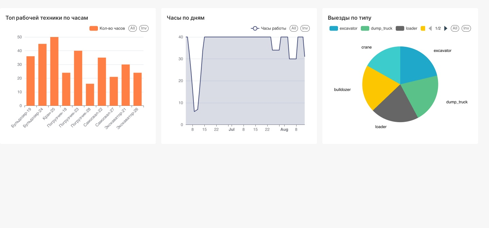
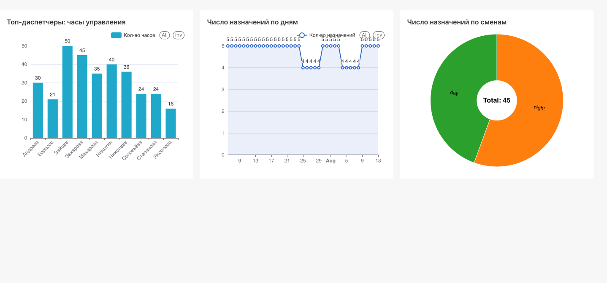
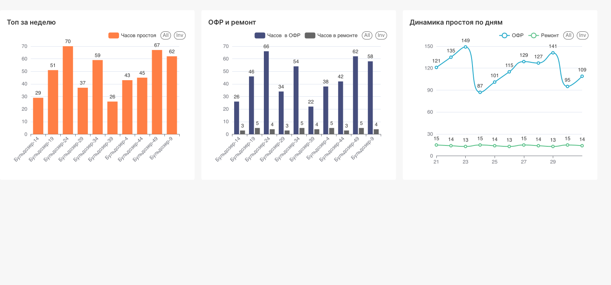

# dwh-equipment-clickhouse

Хранилище данных для аналитики работы техники и диспетчеров.

**Стек:** PostgreSQL (OLTP) → ClickHouse (**ODS → DDS → DM**) → Airflow · MinIO (cold-tier) · Superset (BI).

## Дашборды







| Дашборд | Файл |
|---|---|
| Загруженность техники | `docs/screenshots/загруженность-техники.jpg` |
| Нагрузка диспетчеров | `docs/screenshots/нагрузка-диспетчеров.jpg` |
| Простои техники | `docs/screenshots/простои-техники.jpg` |

## Быстрый старт

```bash
cp .env.example .env
docker compose up -d --build
```

При первом запуске: DDL/seed в PG, бакет MinIO `ch-cold`, сборка Superset (драйвер ClickHouse), затем триггер DAG **`dwh_pipeline`**.

| Сервис | URL / хост | Логин |
|---|---|---|
| Airflow | http://localhost:8080 | `admin` / `admin` |
| Superset | http://localhost:8088 | `admin` / `admin` |
| MinIO | http://localhost:9001 | `dwh` / `dwhpassword` |
| ClickHouse | `localhost:8123` | `dwh` / `dwh` |
| PostgreSQL | `localhost:5432` / `source_db` | `dwh` / `dwh` |

Секреты — в `.env` (см. `.env.example`). 
Пароль ClickHouse — из `.env` через entrypoint образа; ключи MinIO в `config.xml` — `from_env`. В SQL-загрузках — плейсхолдеры `{{POSTGRES_*}}`
подставляет Airflow из того же `.env`.

## Пайплайн

Один DAG **`dwh_pipeline`** (`@daily`):

1. **`load_ods`** — PostgreSQL → ODS (полная загрузка, если пусто; иначе инкремент)
2. **`transform_dds`** — ODS → DDS (измерения SCD2 + append-only факт) + TTL cold
3. **`build_dm`** — DDS → три денормализованные витрины

## Структура репозитория

```text
dags/           DAG Airflow и клиент ClickHouse
sql/pg/         DDL и seed OLTP-источника
sql/ch/         DDL и загрузки слоёв ClickHouse
clickhouse/     Конфиг сервера (пользователи, S3 cold-диск)
superset/       Образ и конфиг BI
scripts/        Вспомогательные скрипты (бакеты MinIO и т.п.)
docs/           Архитектура, слои, гайд по Superset, скриншоты
```

## Документация

- [Архитектура](docs/ARCHITECTURE.md)
- [Слои ODS / DDS / DM](docs/LAYERS.md)
- [Superset](docs/SUPERSET.md)

## Эксплуатация

```bash
# остановить / запустить (тома сохранить)
docker compose stop
docker compose start postgres clickhouse minio postgres-airflow \
  airflow-scheduler airflow-webserver postgres-superset superset

# полный сброс
docker compose down -v && docker compose up -d --build

# проверить число строк в DM
docker exec -it dwh-clickhouse clickhouse-client --user dwh --password dwh -q \
  "SELECT 'utilization' t, count() FROM dm.equipment_utilization_daily
   UNION ALL SELECT 'workload', count() FROM dm.dispatcher_workload_daily
   UNION ALL SELECT 'nonproductive', count() FROM dm.equipment_nonproductive_daily"
```

После смены учётных данных на `dwh` один раз выполните `docker compose down -v`, чтобы тома пересоздались с новыми пользователями.
